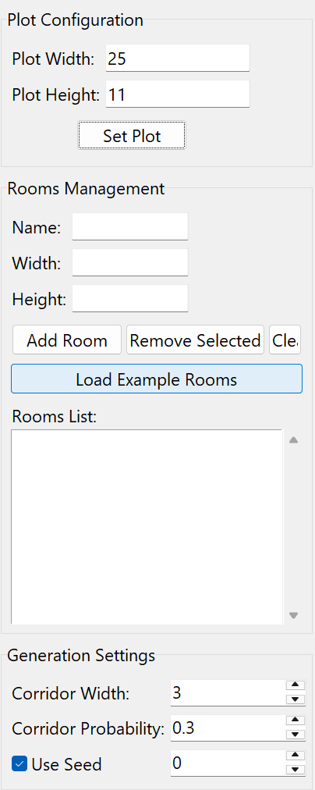

# Automated Floorplan Generation and Optimization System

A constraint-based floorplan generation tool developed as part of a 6-member team.

## Features

- Room placement optimization
- Room rotation support
- Corridor-aware space allocation
- Layout scoring and ranking
- Top-100 solution generation
- Tkinter GUI
- Matplotlib visualization
- JSON import/export

## Technologies

- Python
- Tkinter
- Matplotlib
- Optimization Algorithms

## Screenshots

### Input Configuration



### Generated Floorplan


### Top 100 Layout Rankings


## Run

```bash
pip install -r requirements.txt
python ui_generator.py
```

## Project Description

Developed a floorplan generation system in a 6-member team to automatically arrange rooms within plot boundaries under area and circulation constraints. Implemented room placement, orientation swapping, layout scoring, and optimization workflows. Built a Tkinter-Matplotlib GUI for visualization, comparison, and JSON-based import/export.
